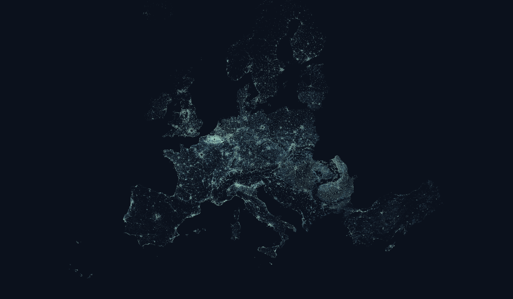

# Urban Morphological Zones

An Urban Morphological Zone is a set of urban areas laying less than
200m apart. These areas are defined from land cover classes
contributing to the urban tissue and function.

This visualization explores those zones at a continent-level scale.
Zoom and pan to explore the data.

Data is provided by the
[European Environmental Agency](https://www.eea.europa.eu/data-and-maps/data/urban-morphological-zones-2006-1).

The dataset's 130,932 polygons are rendered using WebGL on a globe
projection from [deck.gl](https://deck.gl).
